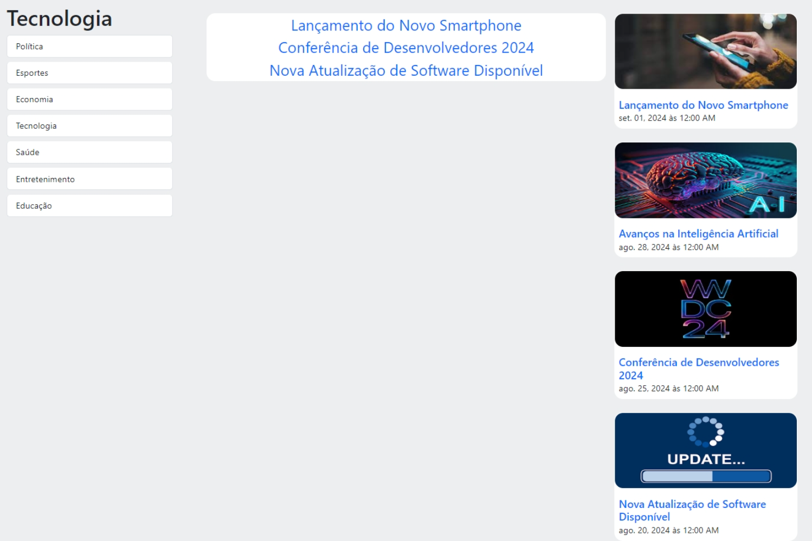

# Blog de Noticias

Este projeto é uma aplicação de blog simples desenvolvida em Angular. O objetivo principal é proporcionar uma base prática para estudar os conceitos fundamentais do Angular, como módulos, componentes, roteamento

### `Status`

Finalizado

### `O que foi Usado?`

- Angular 18
- Sass

### `Galeria de Captura de Telas`

   

     
   

   

     
   
  

   

     
   
  

   

 <!--  
  | -->